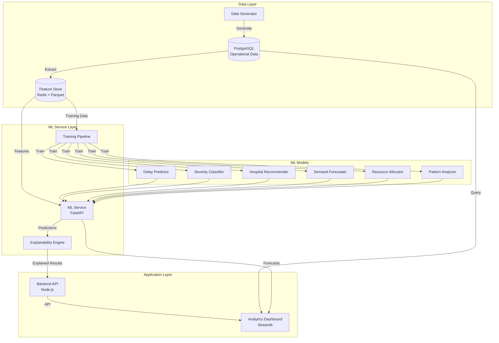

# Design Document: Enhanced ML Data Exploration

## Overview

This design transforms ERIS from a basic ML delay prediction system into a comprehensive ML intelligence platform. The enhancement introduces five major subsystems:

1. **Data Generation Engine** - Creates realistic, production-quality emergency response datasets with temporal, spatial, and causal correlations
2. **Feature Store** - Centralized feature management system ensuring consistency between training and inference
3. **Multi-Model ML Service** - Expands beyond delay prediction to include severity classification, hospital recommendation, demand forecasting, and resource allocation
4. **Analytics & Exploration Dashboard** - Advanced visualization and interactive data exploration interface
5. **ML Operations Pipeline** - Automated training, evaluation, monitoring, and explainability infrastructure

### Design Philosophy

**Separation of Concerns**: The design maintains clear boundaries between data generation, feature engineering, model training, inference, and visualization. Each component can evolve independently.

**Production-First**: All components are designed for production deployment with considerations for latency, scalability, monitoring, and failure handling.

**Explainability by Default**: Every ML prediction includes human-readable explanations using SHAP values and natural language generation.

**Incremental Adoption**: The design allows gradual rollout - existing delay prediction continues working while new capabilities are added incrementally.

## Architecture

### System Components



### Technology Stack

**Data Generation & Feature Engineering**:
- Python 3.11+ with NumPy, Pandas for data manipulation
- Faker library for realistic data generation
- Scipy for statistical distributions
- Parquet format for efficient feature storage

**Feature Store**:
- Redis for online feature serving (<100ms latency)
- Parquet files on disk for offline feature storage
- Feature versioning using timestamps and metadata

**ML Models**:
- Scikit-learn for traditional ML (Random Forest, Gradient Boosting)
- XGBoost/LightGBM for gradient boosting models
- Prophet for time series forecasting
- Isolation Forest for anomaly detection
- SHAP library for model explainability

**ML Service**:
- FastAPI for high-performance async API
- Pydantic for request/response validation
- Model caching with TTL for performance
- Batch inference support

**Analytics Dashboard**:
- Streamlit for rapid development and interactivity
- Plotly for interactive visualizations
- Pandas for data manipulation
- Scheduled report generation with ReportLab

**Training Pipeline**:
- MLflow for experiment tracking and model registry
- Scikit-learn pipelines for reproducibility
- Optuna for hyperparameter optimization
- Scheduled execution with cron or Airflow

### Data Flow

**Real-Time Inference Flow**:
1. Emergency request arrives at Backend API
2. Backend calls Feature Store to retrieve pre-computed features
3. Backend calls ML Service with request data + features
4. ML Service runs all relevant models (delay, severity, hospital recommendation)
5. Explainability Engine generates SHAP values and natural language explanations
6. Results returned to Backend with <500ms total latency
7. Backend stores predictions in PostgreSQL for monitoring

**Training Flow**:
1. Training Pipeline extracts historical data from PostgreSQL
2. Feature Store computes features for training dataset
3. Data split into train/validation/test with temporal ordering
4. Hyperparameter tuning on validation set
5. Model evaluation on test set
6. If new model outperforms production model, promote to production
7. Store model artifacts, metrics, and metadata in MLflow

**Analytics Flow**:
1. Analytics Dashboard queries PostgreSQL for operational data
2. Dashboard queries ML Service for forecasts and predictions
3. Dashboard queries Feature Store for feature distributions
4. Interactive visualizations update based on user filters
5. Export capabilities for reports and external analysis

## Components and Interfaces

### 1. Data Generator

**Purpose**: Generate realistic emergency response datasets for ML training and system testing.

**Implementation**: Python module `ml_service/data_generator.py`

**Key Classes**:

```python
class EmergencyRequestGenerator:
    """Generates realistic emergency requests with temporal and spatial patterns."""
    
    def generate_requests(
        self,
        start_date: datetime,
        end_date: datetime,
        base_volume: int = 100,  # requests per day
        geographic_bounds: Tuple[float, float, float, float] = None
    ) -> pd.DataFrame:
        """
        Generate emergency requests with realistic patterns.
        
        Returns DataFrame with columns:
        - timestamp, location_lat, location_lng, emergency_type,
        - patient_name, patient_phone, pickup_address
        """
        pass

class AmbulanceFleetGenerator:
    """Generates realistic ambulance fleet data."""
    
    def generate_fleet(
        self,
        num_ambulances: int,
        hospitals: List[Dict],
        start_date: datetime,
        end_date: datetime
    ) -> pd.DataFrame:
        """
        Generate ambulance fleet with driver schedules and maintenance windows.
        
        Returns DataFrame with columns:
        - ambulance_id, hospital_id, driver_name, plate_number,
        - location_lat, location_lng, is_available, shift_start, shift_end
        """
        pass

class HospitalCapacityGenerator:
    """Generates realistic hospital capacity data with time-varying availability."""
    
    def generate_capacity_timeline(
        self,
        hospitals: List[Dict],
        start_date: datetime,
        end_date: datetime,
        granularity: str = "hourly"
    ) -> pd.DataFrame:
        """
        Generate hospital capacity timeline.
        
        Returns DataFrame with columns:
        - timestamp, hospital_id, icu_beds_available,
        - general_beds_available, ventilators_available
        """
        pass

class GroundTruthLabeler:
    """Generates ground truth delay labels based on causal factors."""
    
    def compute_delay(
        self,
        distance_km: float,
        traffic_level: str,
        weather: str,
        time_of_day: int,
        ambulance_availability: int
    ) -> Tuple[float, str]:
        """
        Compute realistic delay based on causal factors.
        
        Returns: (delay_minutes, risk_category)
        """
        pass
```

**API Endpoints** (exposed via ML Service):

```python
POST /api/ml/generate-dataset
Request:
{
    "start_date": "2025-01-01",
    "end_date": "2025-12-31",
    "volume_per_day": 100,
    "geographic_bounds": [lat_min, lat_max, lng_min, lng_max],
    "export_format": "parquet"  # or "csv", "json"
}

Response:
{
    "dataset_id": "uuid",
    "num_requests": 36500,
    "num_ambulances": 50,
    "date_range": ["2025-01-01", "2025-12-31"],
    "file_paths": {
        "requests": "/data/requests_uuid.parquet",
        "ambulances": "/data/ambulances_uuid.parquet",
        "hospitals": "/data/hospitals_uuid.parquet"
    },
    "metadata": {
        "generation_params": {...},
        "statistics": {
            "avg_requests_per_day": 100,
            "emergency_type_distribution": {...},
            "geographic_coverage": {...}
        }
    }
}
```

### 2. Feature Store

**Purpose**: Centralized feature management ensuring consistency between training and inference.

**Implementation**: Python module `ml_service/feature_store.py` with Redis backend

**Architecture**:
- **Online Store**: Redis for low-latency feature serving (<100ms)
- **Offline Store**: Parquet files for batch training
- **Feature Registry**: Metadata store for feature definitions

**Key Classes**:

```python
class FeatureStore:
    """Central feature management system."""
    
    def __init__(self, redis_client, offline_path: str):
        self.redis = redis_client
        self.offline_path = offline_path
        self.registry = FeatureRegistry()
    
    def compute_features(
        self,
        request_data: Dict,
        context_data: Dict
    ) -> Dict[str, Any]:
        """
        Compute all features for a request.
        
        Args:
            request_data: Emergency request details
            context_data: Contextual data (traffic, weather, etc.)
        
        Returns: Dictionary of computed features
        """
        pass
    
    def get_online_features(
        self,
        feature_names: List[str],
        entity_id: str
    ) -> Dict[str, Any]:
        """Retrieve features from online store (Redis)."""
        pass
    
    def get_offline_features(
        self,
        feature_names: List[str],
        entity_ids: List[str],
        timestamp_range: Tuple[datetime, datetime]
    ) -> pd.DataFrame:
        """Retrieve features from offline store for training."""
        pass
    
    def materialize_features(
        self,
        feature_group: str,
        start_date: datetime,
        end_date: datetime
    ):
        """Compute and store features for a date range."""
        pass

class FeatureRegistry:
    """Metadata registry for feature definitions."""
    
    def register_feature(
        self,
        name: str,
        computation_fn: Callable,
        dependencies: List[str],
        data_type: str,
        description: str
    ):
        """Register a new feature definition."""
        pass
```

**Feature Categories**:

1. **Temporal Features**:
   - `hour_of_day`, `day_of_week`, `month`, `is_weekend`, `is_holiday`
   - `time_since_last_request_mins`, `requests_last_hour`, `requests_last_24h`

2. **Geographic Features**:
   - `distance_to_nearest_hospital_km`, `distance_to_assigned_hospital_km`
   - `area_type` (urban/suburban/rural), `population_density`
   - `historical_request_density_area`, `avg_response_time_area`

3. **Contextual Features**:
   - `traffic_level` (low/medium/high), `traffic_severity_score`
   - `weather` (clear/rain/fog/snow), `temperature`, `visibility`
   - `available_ambulances_nearby`, `nearest_ambulance_distance_km`
   - `hospital_icu_capacity_pct`, `hospital_general_capacity_pct`

4. **Historical Aggregation Features**:
   - `avg_delay_last_7days_area`, `avg_delay_last_30days_area`
   - `hospital_utilization_rate_24h`, `ambulance_utilization_rate_24h`
   - `emergency_type_frequency_area_30d`

5. **Derived Features**:
   - `traffic_adjusted_distance` = distance * traffic_multiplier
   - `weather_adjusted_delay` = base_delay * weather_multiplier
   - `capacity_weighted_hospital_score` = distance_score * capacity_score

**API Endpoints**:

```python
POST /api/features/compute
Request:
{
    "request_id": "uuid",
    "location_lat": 40.7128,
    "location_lng": -74.0060,
    "emergency_type": "cardiac",
    "timestamp": "2025-01-15T14:30:00Z"
}

Response:
{
    "features": {
        "hour_of_day": 14,
        "day_of_week": 2,
        "distance_to_nearest_hospital_km": 3.5,
        "traffic_level": "high",
        "available_ambulances_nearby": 2,
        ...
    },
    "computation_time_ms": 45
}

GET /api/features/batch
Query params: feature_names, entity_ids, start_date, end_date
Response: Parquet file download
```

### 3. Multi-Model ML Service

**Purpose**: Provide multiple ML prediction types beyond delay prediction.

**Implementation**: FastAPI service `ml_service/app.py`

**Model Inventory**:

1. **Delay Predictor** (existing, enhanced)
   - Model: Gradient Boosting Regressor
   - Input: 25+ features
   - Output: Expected delay (minutes), risk category (Low/Medium/High/Severe)

2. **Severity Classifier**
   - Model: Random Forest Classifier
   - Input: Emergency type, patient vitals, location, time
   - Output: Severity level (Critical/High/Medium/Low), confidence score

3. **Hospital Recommender**
   - Model: Multi-criteria scoring model
   - Input: Patient location, emergency type, hospital capacities, distances
   - Output: Ranked list of hospitals with scores

4. **Demand Forecaster**
   - Model: Prophet time series model
   - Input: Historical request volumes, external factors
   - Output: Hourly/daily forecasts with confidence intervals

5. **Resource Allocator**
   - Model: Optimization model with ML predictions
   - Input: Current fleet positions, predicted demand, hospital capacities
   - Output: Recommended ambulance repositioning, expected impact

6. **Pattern Analyzer**
   - Model: Isolation Forest + Statistical tests
   - Input: Historical patterns, current metrics
   - Output: Detected anomalies, pattern changes, alerts

**API Endpoints**:

```python
POST /api/ml/predict/delay
Request:
{
    "distance_km": 5.2,
    "time_of_day": 14,
    "day_of_week": 2,
    "traffic_level": "high",
    "weather": "rain",
    "area_type": "urban",
    "available_ambulances_nearby": 2
}

Response:
{
    "delay_minutes": 18.5,
    "risk_category": "High",
    "confidence": 0.87,
    "prediction_interval": [15.2, 21.8],
    "model_version": "v2.3.1"
}

POST /api/ml/predict/severity
Request:
{
    "emergency_type": "cardiac",
    "patient_age": 65,
    "vital_signs": {"heart_rate": 120, "bp_systolic": 160},
    "location_type": "home"
}

Response:
{
    "severity": "Critical",
    "confidence": 0.92,
    "recommended_actions": ["Dispatch ALS ambulance", "Alert receiving hospital"],
    "model_version": "v1.2.0"
}

POST /api/ml/recommend/hospital
Request:
{
    "patient_location": {"lat": 40.7128, "lng": -74.0060},
    "emergency_type": "stroke",
    "severity": "Critical",
    "current_time": "2025-01-15T14:30:00Z"
}

Response:
{
    "recommendations": [
        {
            "hospital_id": "uuid1",
            "hospital_name": "City General Hospital",
            "score": 0.95,
            "distance_km": 3.2,
            "estimated_travel_time_mins": 8,
            "icu_beds_available": 5,
            "has_stroke_center": true,
            "reasons": ["Closest stroke center", "High capacity", "Low traffic route"]
        },
        ...
    ]
}

GET /api/ml/forecast/demand
Query params: forecast_horizon=24h, granularity=hourly, region=all
Response:
{
    "forecasts": [
        {
            "timestamp": "2025-01-15T15:00:00Z",
            "predicted_requests": 12,
            "confidence_interval": [9, 15],
            "by_emergency_type": {
                "cardiac": 3,
                "trauma": 4,
                "respiratory": 2,
                "other": 3
            }
        },
        ...
    ],
    "model_version": "prophet_v1.0",
    "generated_at": "2025-01-15T14:30:00Z"
}

POST /api/ml/allocate/resources
Request:
{
    "current_fleet": [...],
    "predicted_demand": [...],
    "hospital_capacities": [...],
    "optimization_horizon_hours": 4
}

Response:
{
    "recommendations": [
        {
            "ambulance_id": "uuid1",
            "current_location": {"lat": 40.7128, "lng": -74.0060},
            "recommended_location": {"lat": 40.7580, "lng": -73.9855},
            "reason": "High predicted demand in Upper East Side",
            "expected_response_time_improvement_mins": 3.5,
            "priority": "high"
        },
        ...
    ],
    "expected_impact": {
        "avg_response_time_reduction_mins": 2.8,
        "coverage_improvement_pct": 15
    }
}

POST /api/ml/analyze/patterns
Request:
{
    "analysis_type": "anomaly_detection",
    "time_range": {"start": "2025-01-01", "end": "2025-01-15"},
    "metrics": ["request_volume", "response_time", "hospital_utilization"]
}

Response:
{
    "anomalies": [
        {
            "timestamp": "2025-01-10T18:00:00Z",
            "metric": "request_volume",
            "value": 45,
            "expected_range": [20, 30],
            "severity": "high",
            "potential_causes": ["Special event nearby", "Weather conditions"],
            "recommended_investigation": "Check for local events or incidents"
        },
        ...
    ],
    "patterns": [
        {
            "pattern_type": "temporal",
            "description": "Request volume peaks at 6-8 PM on weekdays",
            "confidence": 0.94,
            "first_detected": "2025-01-05"
        },
        ...
    ]
}

POST /api/ml/predict/batch
Request:
{
    "predictions": [
        {"type": "delay", "data": {...}},
        {"type": "severity", "data": {...}},
        ...
    ]
}

Response:
{
    "results": [...],
    "total_latency_ms": 450
}
```

### 4. Explainability Engine

**Purpose**: Provide human-readable explanations for all ML predictions.

**Implementation**: Python module `ml_service/explainability.py`

**Key Classes**:

```python
class ExplainabilityEngine:
    """Generates explanations for ML predictions."""
    
    def __init__(self):
        self.shap_explainers = {}  # Model-specific SHAP explainers
        self.nlg_templates = self._load_templates()
    
    def explain_prediction(
        self,
        model_name: str,
        prediction: Any,
        features: Dict[str, Any],
        model: Any
    ) -> Dict:
        """
        Generate comprehensive explanation for a prediction.
        
        Returns:
            - feature_importance: SHAP values for each feature
            - natural_language: Human-readable explanation
            - counterfactuals: "What if" scenarios
            - confidence_explanation: Why this confidence level
        """
        pass
    
    def compute_shap_values(
        self,
        model: Any,
        features: np.ndarray,
        feature_names: List[str]
    ) -> Dict[str, float]:
        """Compute SHAP values for feature importance."""
        pass
    
    def generate_natural_language(
        self,
        prediction: Any,
        shap_values: Dict[str, float],
        template_type: str
    ) -> str:
        """Generate natural language explanation."""
        pass
    
    def generate_counterfactuals(
        self,
        model: Any,
        features: Dict[str, Any],
        target_outcome: Any,
        num_scenarios: int = 3
    ) -> List[Dict]:
        """Generate counterfactual explanations."""
        pass
```

**Explanation Types**:

1. **Feature Importance** (SHAP values):
   ```json
   {
       "traffic_level": 0.35,
       "distance_km": 0.28,
       "time_of_day": 0.15,
       "available_ambulances": 0.12,
       "weather": 0.10
   }
   ```

2. **Natural Language**:
   ```
   "High delay risk predicted due to heavy traffic (35% impact) and long distance (28% impact). 
   The afternoon time slot (15% impact) and limited ambulance availability (12% impact) also 
   contribute to the delay. Rain conditions add minor additional delay (10% impact)."
   ```

3. **Counterfactuals**:
   ```json
   [
       {
           "scenario": "If traffic were light instead of heavy",
           "predicted_delay": 12.5,
           "delay_reduction": 6.0,
           "feasibility": "low"
       },
       {
           "scenario": "If 2 more ambulances were available nearby",
           "predicted_delay": 16.0,
           "delay_reduction": 2.5,
           "feasibility": "medium"
       }
   ]
   ```

4. **Confidence Explanation**:
   ```
   "Confidence is high (87%) because this scenario closely matches 450 historical cases 
   with similar traffic, distance, and time patterns. The model has 92% accuracy on 
   similar cases."
   ```

**Integration with ML Service**:

All prediction endpoints automatically include explanations:

```python
{
    "prediction": {...},
    "explanation": {
        "feature_importance": {...},
        "natural_language": "...",
        "counterfactuals": [...],
        "confidence_explanation": "...",
        "top_3_factors": [
            {"factor": "traffic_level", "impact": 0.35, "direction": "increases_delay"},
            {"factor": "distance_km", "impact": 0.28, "direction": "increases_delay"},
            {"factor": "time_of_day", "impact": 0.15, "direction": "increases_delay"}
        ]
    }
}
```

### 5. Analytics Dashboard

**Purpose**: Interactive data exploration and visualization interface.

**Implementation**: Streamlit app `admin-dashboard/app.py` (enhanced)

**New Pages/Sections**:

1. **Data Explorer**:
   - Interactive time-series plots with drill-down
   - Geographic heatmaps with filters
   - Correlation matrices
   - Distribution plots with statistical summaries
   - Export capabilities

2. **ML Model Performance**:
   - Accuracy trends over time
   - Prediction distribution analysis
   - Error analysis (residual plots, confusion matrices)
   - Feature importance visualizations
   - Model comparison views

3. **Demand Forecasting**:
   - 24-hour and 7-day forecast visualizations
   - Actual vs predicted comparisons
   - Forecast accuracy metrics
   - Regional demand heatmaps

4. **Resource Allocation**:
   - Current fleet positioning map
   - Recommended repositioning visualizations
   - Expected impact metrics
   - Historical allocation effectiveness

5. **Pattern Analysis**:
   - Detected anomalies timeline
   - Pattern discovery visualizations
   - Alert management interface
   - Investigation tools

6. **Reports**:
   - Executive summary dashboards
   - Automated weekly/monthly reports
   - Custom report builder
   - Export to PDF/Excel

**Key Features**:

```python
# Interactive filtering
st.sidebar.date_input("Date Range")
st.sidebar.multiselect("Emergency Types")
st.sidebar.multiselect("Hospitals")
st.sidebar.slider("Risk Level")

# Real-time updates
st_autorefresh(interval=30000)  # 30 seconds

# Export capabilities
st.download_button("Export to CSV", data=df.to_csv())
st.download_button("Export Visualization", data=fig.to_image())

# Drill-down capabilities
if st.button("View Details"):
    show_detailed_view(selected_item)
```

### 6. Training Pipeline

**Purpose**: Automated model training, evaluation, and deployment.

**Implementation**: Python module `ml_service/training_pipeline.py`

**Key Components**:

```python
class TrainingPipeline:
    """Automated ML model training pipeline."""
    
    def __init__(self, mlflow_uri: str):
        self.mlflow_client = mlflow.tracking.MlflowClient(mlflow_uri)
        self.feature_store = FeatureStore()
    
    def run_training(
        self,
        model_name: str,
        training_config: Dict
    ) -> str:
        """
        Execute complete training pipeline.
        
        Steps:
        1. Extract data from PostgreSQL
        2. Compute features via Feature Store
        3. Split data (temporal ordering)
        4. Hyperparameter tuning
        5. Train final model
        6. Evaluate on test set
        7. Compare with production model
        8. Promote if better
        
        Returns: run_id for tracking
        """
        pass
    
    def extract_training_data(
        self,
        start_date: datetime,
        end_date: datetime
    ) -> pd.DataFrame:
        """Extract historical data for training."""
        pass
    
    def split_data(
        self,
        df: pd.DataFrame,
        train_ratio: float = 0.7,
        val_ratio: float = 0.15
    ) -> Tuple[pd.DataFrame, pd.DataFrame, pd.DataFrame]:
        """Split data with temporal ordering (no data leakage)."""
        pass
    
    def tune_hyperparameters(
        self,
        X_train: pd.DataFrame,
        y_train: pd.Series,
        X_val: pd.DataFrame,
        y_val: pd.Series,
        model_type: str
    ) -> Dict:
        """Hyperparameter tuning using Optuna."""
        pass
    
    def evaluate_model(
        self,
        model: Any,
        X_test: pd.DataFrame,
        y_test: pd.Series,
        model_type: str
    ) -> Dict:
        """Comprehensive model evaluation."""
        pass
    
    def compare_models(
        self,
        new_model_metrics: Dict,
        production_model_metrics: Dict
    ) -> bool:
        """Determine if new model should be promoted."""
        pass
    
    def promote_model(
        self,
        run_id: str,
        model_name: str
    ):
        """Promote model to production in MLflow registry."""
        pass
```

**Evaluation Metrics**:

- **Regression (Delay Prediction)**:
  - MAE (Mean Absolute Error)
  - RMSE (Root Mean Squared Error)
  - R² Score
  - MAPE (Mean Absolute Percentage Error)

- **Classification (Severity, Risk)**:
  - Accuracy
  - Precision, Recall, F1 per class
  - AUC-ROC
  - Confusion Matrix

- **Forecasting (Demand)**:
  - MAE, RMSE on forecast horizon
  - Coverage of prediction intervals
  - Directional accuracy

**Scheduled Execution**:

```bash
# Cron job for weekly retraining
0 2 * * 0 python ml_service/training_pipeline.py --model delay_predictor
0 3 * * 0 python ml_service/training_pipeline.py --model severity_classifier
0 4 * * 0 python ml_service/training_pipeline.py --model demand_forecaster
```

## Data Models

### Database Schema Extensions

**New Tables**:

```sql
-- ML Predictions Log
CREATE TABLE ml_predictions (
    id UUID PRIMARY KEY DEFAULT gen_random_uuid(),
    request_id UUID REFERENCES requests(id),
    model_name VARCHAR(100) NOT NULL,
    model_version VARCHAR(50) NOT NULL,
    prediction_type VARCHAR(50) NOT NULL,
    prediction_value JSONB NOT NULL,
    features_used JSONB NOT NULL,
    explanation JSONB,
    confidence_score FLOAT,
    latency_ms INTEGER,
    created_at TIMESTAMP DEFAULT NOW()
);

CREATE INDEX idx_ml_predictions_request ON ml_predictions(request_id);
CREATE INDEX idx_ml_predictions_model ON ml_predictions(model_name, created_at);

-- Feature Store Metadata
CREATE TABLE feature_definitions (
    id UUID PRIMARY KEY DEFAULT gen_random_uuid(),
    feature_name VARCHAR(100) UNIQUE NOT NULL,
    feature_type VARCHAR(50) NOT NULL,
    computation_logic TEXT,
    dependencies JSONB,
    data_type VARCHAR(50),
    description TEXT,
    version VARCHAR(50),
    created_at TIMESTAMP DEFAULT NOW(),
    updated_at TIMESTAMP DEFAULT NOW()
);

-- Demand Forecasts
CREATE TABLE demand_forecasts (
    id UUID PRIMARY KEY DEFAULT gen_random_uuid(),
    forecast_timestamp TIMESTAMP NOT NULL,
    generated_at TIMESTAMP NOT NULL,
    horizon_hours INTEGER NOT NULL,
    predicted_requests INTEGER NOT NULL,
    confidence_interval_lower INTEGER,
    confidence_interval_upper INTEGER,
    by_emergency_type JSONB,
    by_region JSONB,
    model_version VARCHAR(50),
    actual_requests INTEGER,  -- Filled in after the fact
    created_at TIMESTAMP DEFAULT NOW()
);

CREATE INDEX idx_demand_forecasts_timestamp ON demand_forecasts(forecast_timestamp);

-- Resource Allocation Recommendations
CREATE TABLE resource_recommendations (
    id UUID PRIMARY KEY DEFAULT gen_random_uuid(),
    ambulance_id UUID REFERENCES ambulances(id),
    recommendation_type VARCHAR(50) NOT NULL,
    current_location_lat FLOAT,
    current_location_lng FLOAT,
    recommended_location_lat FLOAT,
    recommended_location_lng FLOAT,
    reason TEXT,
    expected_impact JSONB,
    priority VARCHAR(20),
    status VARCHAR(50) DEFAULT 'pending',
    created_at TIMESTAMP DEFAULT NOW(),
    executed_at TIMESTAMP,
    outcome JSONB
);

-- Pattern Analysis Results
CREATE TABLE pattern_analysis (
    id UUID PRIMARY KEY DEFAULT gen_random_uuid(),
    analysis_type VARCHAR(50) NOT NULL,
    pattern_type VARCHAR(50),
    description TEXT,
    detected_at TIMESTAMP NOT NULL,
    severity VARCHAR(20),
    affected_metrics JSONB,
    potential_causes JSONB,
    recommended_actions JSONB,
    confidence_score FLOAT,
    status VARCHAR(50) DEFAULT 'new',
    investigated_at TIMESTAMP,
    investigation_notes TEXT,
    created_at TIMESTAMP DEFAULT NOW()
);

-- Data Quality Metrics
CREATE TABLE data_quality_metrics (
    id UUID PRIMARY KEY DEFAULT gen_random_uuid(),
    metric_name VARCHAR(100) NOT NULL,
    metric_value FLOAT NOT NULL,
    threshold_value FLOAT,
    status VARCHAR(20),  -- 'pass', 'warning', 'fail'
    details JSONB,
    measured_at TIMESTAMP NOT NULL,
    created_at TIMESTAMP DEFAULT NOW()
);

CREATE INDEX idx_data_quality_measured ON data_quality_metrics(metric_name, measured_at);

-- Model Training Runs
CREATE TABLE model_training_runs (
    id UUID PRIMARY KEY DEFAULT gen_random_uuid(),
    model_name VARCHAR(100) NOT NULL,
    run_id VARCHAR(100) UNIQUE NOT NULL,  -- MLflow run ID
    training_start TIMESTAMP NOT NULL,
    training_end TIMESTAMP,
    data_version VARCHAR(50),
    hyperparameters JSONB,
    metrics JSONB,
    status VARCHAR(50),  -- 'running', 'completed', 'failed', 'promoted'
    promoted_to_production BOOLEAN DEFAULT FALSE,
    promoted_at TIMESTAMP,
    created_at TIMESTAMP DEFAULT NOW()
);

CREATE INDEX idx_model_training_model ON model_training_runs(model_name, training_start);
```

### Feature Store Schema

**Redis Keys Structure**:

```
features:online:{entity_type}:{entity_id}:{feature_name} -> value
features:online:{entity_type}:{entity_id}:_metadata -> {timestamp, version}

Example:
features:online:request:uuid123:hour_of_day -> 14
features:online:request:uuid123:traffic_level -> "high"
features:online:request:uuid123:_metadata -> {"timestamp": "2025-01-15T14:30:00Z", "version": "v1"}
```

**Parquet Schema** (offline features):

```python
{
    "entity_id": "string",
    "entity_type": "string",
    "timestamp": "timestamp",
    "feature_version": "string",
    
    # Temporal features
    "hour_of_day": "int32",
    "day_of_week": "int32",
    "month": "int32",
    "is_weekend": "bool",
    "is_holiday": "bool",
    
    # Geographic features
    "distance_to_nearest_hospital_km": "float32",
    "area_type": "string",
    "population_density": "float32",
    
    # Contextual features
    "traffic_level": "string",
    "traffic_severity_score": "float32",
    "weather": "string",
    "temperature": "float32",
    "available_ambulances_nearby": "int32",
    
    # Historical aggregations
    "avg_delay_last_7days_area": "float32",
    "hospital_utilization_rate_24h": "float32",
    
    # Derived features
    "traffic_adjusted_distance": "float32",
    "capacity_weighted_hospital_score": "float32"
}
```

### MLflow Model Registry Schema

**Model Metadata**:

```python
{
    "name": "delay_predictor",
    "version": "v2.3.1",
    "stage": "Production",  # or "Staging", "Archived"
    "description": "Gradient Boosting model for delay prediction",
    "tags": {
        "model_type": "regression",
        "framework": "xgboost",
        "feature_version": "v1.2"
    },
    "metrics": {
        "test_mae": 2.3,
        "test_rmse": 3.1,
        "test_r2": 0.87
    },
    "params": {
        "n_estimators": 200,
        "max_depth": 8,
        "learning_rate": 0.05
    },
    "training_data": {
        "start_date": "2024-01-01",
        "end_date": "2024-12-31",
        "num_samples": 50000
    },
    "created_at": "2025-01-15T10:00:00Z",
    "promoted_at": "2025-01-15T12:00:00Z"
}
```


## Correctness Properties

*A property is a characteristic or behavior that should hold true across all valid executions of a system—essentially, a formal statement about what the system should do. Properties serve as the bridge between human-readable specifications and machine-verifiable correctness guarantees.*

### Property Reflection

After analyzing all acceptance criteria, I identified the following consolidation opportunities to eliminate redundancy:

**Consolidations**:
1. **Metadata completeness properties** (1.9, 7.9, 8.9, 9.9, 10.9, 11.9) - All test that metadata includes required fields. These can be consolidated into a single property about metadata completeness across all components.

2. **Feature computation properties** (7.1, 7.2, 7.3, 7.4, 7.5) - All test that feature computation is deterministic and correct. These can be consolidated into a single property about feature computation correctness.

3. **Explanation completeness properties** (4.9, 6.9, 9.1, 9.6, 9.9) - All test that explanations include required fields. These can be consolidated into a single property about explanation structure.

4. **Caching equivalence properties** (12.3, 12.4, 12.5) - All test that cached/batched operations produce same results as non-cached/individual operations. These can be consolidated into a single property about operation equivalence.

5. **Alert/logging completeness properties** (5.6, 6.8, 10.6, 10.8, 12.7, 12.9) - All test that alerts/logs include required fields. These can be consolidated into a single property about logging completeness.

6. **Data quality detection properties** (10.1, 10.2, 10.3, 10.4) - All test that quality issues are detected. These can be consolidated into a single property about quality monitoring.

**Retained as Separate Properties**:
- Data generation properties (temporal, spatial, correlations) - Each tests different statistical properties
- Pattern detection properties - Each tests different pattern types
- Resource allocation properties - Each tests different constraint types
- Training pipeline properties - Each tests different pipeline stages

### Property 1: Data Generation Temporal Patterns

*For any* generated dataset with specified temporal parameters, the distribution of emergency requests across hours, days, and weeks SHALL match expected seasonal patterns within statistical significance bounds (p < 0.05).

**Validates: Requirements 1.1**

### Property 2: Data Generation Spatial Correlation

*For any* generated dataset with population density map, the spatial distribution of emergency requests SHALL exhibit positive correlation (r > 0.7) with population density.

**Validates: Requirements 1.2**

### Property 3: Data Generation Feature Correlations

*For any* generated dataset, correlated features SHALL maintain expected correlation coefficients: traffic-time correlation (|r| > 0.6), weather-delay correlation (|r| > 0.5), emergency type-location correlation (χ² test p < 0.05).

**Validates: Requirements 1.3**

### Property 4: Data Generation Constraint Satisfaction

*For any* generated ambulance fleet data, all constraints SHALL be satisfied: no overlapping driver shifts, maintenance windows within valid time ranges, performance metrics within realistic bounds.

**Validates: Requirements 1.4**

### Property 5: Data Generation Capacity Invariants

*For any* generated hospital capacity timeline, invariants SHALL hold: bed availability ≥ 0, capacity changes between consecutive time points ≤ max_realistic_change, total capacity ≤ hospital bed_capacity.

**Validates: Requirements 1.5**

### Property 6: Data Generation Configuration Respect

*For any* dataset generation with configuration parameters (date range, geographic bounds, volume, distributions), the generated output SHALL respect all constraints: dates within range, locations within bounds, volume within tolerance (±10%), emergency type distribution within tolerance (±15%).

**Validates: Requirements 1.6**

### Property 7: Data Generation Deterministic Delay Computation

*For any* set of causal factors (distance, traffic, weather, time, ambulance availability), computing delay labels multiple times SHALL produce identical results (deterministic), and delays SHALL increase monotonically with traffic level and distance.

**Validates: Requirements 1.7**

### Property 8: Data Export Format Round-Trip

*For any* generated dataset, exporting to CSV/JSON/Parquet format and re-importing SHALL preserve data equivalence (all values match within floating-point tolerance).

**Validates: Requirements 1.8**

### Property 9: Statistical Summary Computation Correctness

*For any* numeric feature in a dataset, computed statistical summaries (mean, median, quartiles, std dev) SHALL match manually computed values within numerical tolerance (ε = 1e-6).

**Validates: Requirements 2.4**

### Property 10: Data Export Filter Preservation

*For any* filtered dataset, exporting SHALL include only records matching filter criteria, and all matching records SHALL be included (no false positives or false negatives).

**Validates: Requirements 2.7**

### Property 11: Data Quality Metric Detection

*For any* dataset with injected quality issues (missing values, outliers, distribution shifts, consistency violations), quality monitoring SHALL detect all issues with appropriate severity levels.

**Validates: Requirements 2.8, 10.1, 10.2, 10.3, 10.4**

### Property 12: Forecast Output Structure Validity

*For any* demand forecast, the output SHALL include confidence scores ∈ [0, 1], prediction intervals where lower ≤ predicted ≤ upper, and all required fields (timestamp, predicted_requests, by_emergency_type, by_region).

**Validates: Requirements 3.6**

### Property 13: Forecast Storage Round-Trip

*For any* generated forecast, storing to database and retrieving SHALL preserve all data fields with exact equality for integers and within tolerance for floats.

**Validates: Requirements 3.9**

### Property 14: Resource Allocation Constraint Satisfaction

*For any* resource allocation recommendation, all constraints SHALL be satisfied: recommended positions within geographic bounds, ambulances are available, hospitals have capacity, all required fields present.

**Validates: Requirements 4.1, 4.5, 4.6**

### Property 15: Resource Allocation Impact Metrics Validity

*For any* resource allocation recommendation, computed impact metrics SHALL be within valid ranges: response_time_reduction ≥ 0, coverage_improvement ∈ [0, 100], all metrics present.

**Validates: Requirements 4.8**

### Property 16: Pattern Detection Statistical Significance

*For any* dataset with injected known patterns (temporal cycles, geographic clusters, anomalies), pattern detection SHALL identify patterns with statistical significance (p < 0.05) and correct parameters (cycle period ±10%, cluster centers within tolerance).

**Validates: Requirements 5.1, 5.2, 5.3, 5.4, 5.5**

### Property 17: Pattern Detection Baseline Determinism

*For any* historical dataset, computing normal behavior baselines multiple times SHALL produce identical results (deterministic baseline computation).

**Validates: Requirements 5.8**

### Property 18: ML Service Prediction Output Structure

*For any* ML prediction (delay, severity, hospital recommendation), the output SHALL include confidence scores ∈ [0, 1], prediction intervals where applicable, and all required fields for the prediction type.

**Validates: Requirements 6.6**

### Property 19: ML Service Batch-Individual Equivalence

*For any* set of prediction requests, processing individually and processing as a batch SHALL produce equivalent results (same predictions, confidence scores, explanations).

**Validates: Requirements 6.7, 12.5**

### Property 20: Feature Computation Determinism and Correctness

*For any* request data and context, computing features multiple times SHALL produce identical results (deterministic), and computed features SHALL match expected values: hour_of_day ∈ [0, 23], day_of_week ∈ [0, 6], distances ≥ 0, derived features follow correct formulas.

**Validates: Requirements 7.1, 7.2, 7.3, 7.4, 7.5**

### Property 21: Feature Store Incremental Update Equivalence

*For any* dataset, computing features via full computation and via incremental updates SHALL produce equivalent results (same feature values within tolerance).

**Validates: Requirements 7.6**

### Property 22: Feature Store Versioning Integrity

*For any* feature set stored with version identifier, retrieving by that version SHALL return exactly the features that were stored, with no modifications.

**Validates: Requirements 7.7**

### Property 23: Training Data Split Temporal Ordering

*For any* dataset split into train/validation/test sets, temporal ordering SHALL be maintained: max(train_dates) < min(val_dates) < min(test_dates), and no date overlap between sets.

**Validates: Requirements 8.2**

### Property 24: Model Evaluation Metrics Correctness

*For any* model predictions and ground truth labels, computed evaluation metrics (MAE, RMSE, accuracy, precision, recall, F1, AUC-ROC) SHALL match manually computed values within numerical tolerance.

**Validates: Requirements 8.4**

### Property 25: Model Promotion Logic Correctness

*For any* pair of models with known performance metrics, promotion decision SHALL follow correct logic: promote if new_model_metric > current_model_metric + threshold for all critical metrics.

**Validates: Requirements 8.5, 8.6**

### Property 26: Model Versioning Rollback Integrity

*For any* sequence of model versions, rolling back to version N SHALL restore exactly the model state at version N (same parameters, same predictions on test data).

**Validates: Requirements 8.8**

### Property 27: Explanation Feature Importance Validity

*For any* prediction explanation, feature importance scores SHALL sum to expected value (SHAP: sum to prediction - baseline), all scores present for all features used, and top N factors correctly identified.

**Validates: Requirements 9.1, 9.5, 9.6**

### Property 28: Explanation Completeness

*For any* prediction, generated explanation SHALL include all required components: feature importance scores, natural language text (non-empty), counterfactuals (if applicable), confidence indicator, and all fields properly formatted.

**Validates: Requirements 4.9, 6.9, 9.2, 9.3, 9.9**

### Property 29: Explanation Model-Agnostic Compatibility

*For any* model type (regression, classification, ensemble), explanation methods SHALL produce valid output with correct structure for that model type.

**Validates: Requirements 9.7**

### Property 30: Data Quality Alert Generation

*For any* detected quality issue (completeness, drift, consistency, outliers, freshness), an alert SHALL be generated with all required fields: severity level ∈ {low, medium, high, critical}, affected metrics, timestamp, description.

**Validates: Requirements 10.6**

### Property 31: Data Quality Trend Storage Integrity

*For any* sequence of quality metrics over time, storing and retrieving trend data SHALL preserve all data points with correct timestamps and values.

**Validates: Requirements 10.9**

### Property 32: Report Generation Completeness

*For any* generated report (executive summary, weekly, monthly), all required KPIs SHALL be present, metadata SHALL include generation timestamp and data coverage period, and export formats SHALL preserve data integrity.

**Validates: Requirements 11.1, 11.4, 11.8, 11.9**

### Property 33: ML Service Caching Equivalence

*For any* prediction request, results with caching enabled and caching disabled SHALL be equivalent (same predictions, confidence scores, explanations).

**Validates: Requirements 12.3, 12.4**

### Property 34: ML Service Graceful Degradation Validity

*For any* prediction request when models are unavailable, fallback response SHALL be valid: includes fallback indicator, provides cached or default prediction, includes all required fields.

**Validates: Requirements 12.8**

### Property 35: Metadata Completeness Across Components

*For any* generated artifact (dataset, feature set, model, forecast, recommendation, report), associated metadata SHALL include all required fields: generation timestamp, version identifier, configuration parameters, and component-specific metadata.

**Validates: Requirements 1.9, 7.9, 8.9, 11.9**

### Property 36: Logging Completeness Across Operations

*For any* system operation (prediction, quality check, pattern detection, training), logs SHALL include all required fields: timestamp, operation type, inputs, outputs, latency/duration, status, and operation-specific metadata.

**Validates: Requirements 5.6, 6.8, 10.8, 12.7, 12.9**


## Error Handling

### Failure Modes and Recovery Strategies

#### 1. ML Service Failures

**Failure Mode**: ML Service unavailable or model loading fails

**Detection**: Health check endpoint returns error, prediction requests timeout

**Recovery Strategy**:
- Return cached predictions for similar recent requests
- Return default predictions based on historical averages
- Include `fallback_mode: true` flag in response
- Log failure for monitoring
- Alert on-call engineer if downtime > 5 minutes

**Graceful Degradation**:
```python
try:
    prediction = ml_service.predict(features)
except (ConnectionError, TimeoutError, ModelLoadError) as e:
    logger.error(f"ML Service failure: {e}")
    prediction = {
        "delay_minutes": historical_avg_delay,
        "risk_category": "Medium",
        "confidence": 0.5,
        "fallback_mode": true,
        "fallback_reason": "ML service unavailable"
    }
```

#### 2. Feature Store Failures

**Failure Mode**: Redis unavailable, feature computation fails

**Detection**: Redis connection error, feature computation exception

**Recovery Strategy**:
- Compute features on-the-fly without caching
- Use offline feature store (Parquet files) as backup
- Return partial features if some computations fail
- Continue with available features, log missing features

**Graceful Degradation**:
```python
try:
    features = feature_store.get_online_features(feature_names, entity_id)
except RedisConnectionError:
    logger.warning("Redis unavailable, computing features on-the-fly")
    features = feature_store.compute_features_sync(request_data)
except FeatureComputationError as e:
    logger.error(f"Feature computation failed: {e}")
    features = get_partial_features(request_data)  # Use subset of features
```

#### 3. Data Generation Failures

**Failure Mode**: Invalid configuration parameters, generation crashes

**Detection**: Validation errors, runtime exceptions

**Recovery Strategy**:
- Validate all parameters before generation
- Provide clear error messages for invalid configs
- Support partial generation (generate what's possible)
- Save progress periodically for large datasets

**Error Handling**:
```python
def generate_dataset(config):
    try:
        validate_config(config)
    except ValidationError as e:
        return {"error": f"Invalid configuration: {e}", "status": "failed"}
    
    try:
        dataset = generate_with_checkpoints(config)
        return {"status": "success", "dataset_id": dataset.id}
    except GenerationError as e:
        logger.error(f"Generation failed: {e}")
        return {
            "error": str(e),
            "status": "partial",
            "partial_data": get_checkpoint_data()
        }
```

#### 4. Training Pipeline Failures

**Failure Mode**: Training crashes, data extraction fails, model evaluation fails

**Detection**: Training job exceptions, timeout, invalid metrics

**Recovery Strategy**:
- Checkpoint training progress
- Retry failed steps with exponential backoff
- Keep previous production model if new training fails
- Send alerts for training failures
- Maintain training run history for debugging

**Error Handling**:
```python
def run_training_with_retry(model_name, config, max_retries=3):
    for attempt in range(max_retries):
        try:
            run_id = training_pipeline.run_training(model_name, config)
            return {"status": "success", "run_id": run_id}
        except DataExtractionError as e:
            logger.error(f"Data extraction failed (attempt {attempt+1}): {e}")
            if attempt == max_retries - 1:
                alert_on_call("Training data extraction failed after retries")
                return {"status": "failed", "error": str(e)}
            time.sleep(2 ** attempt)  # Exponential backoff
        except TrainingError as e:
            logger.error(f"Training failed: {e}")
            alert_on_call(f"Model training failed: {model_name}")
            return {"status": "failed", "error": str(e), "keep_production_model": True}
```

#### 5. Analytics Dashboard Failures

**Failure Mode**: Data query fails, visualization rendering fails

**Detection**: Query exceptions, rendering errors

**Recovery Strategy**:
- Show cached data with staleness indicator
- Display partial visualizations if some data unavailable
- Provide error messages with retry options
- Degrade to simpler visualizations if complex ones fail

**Error Handling**:
```python
try:
    data = fetch_dashboard_data()
    st.plotly_chart(create_visualization(data))
except QueryError as e:
    st.warning(f"Unable to fetch latest data: {e}")
    cached_data = get_cached_data()
    if cached_data:
        st.info(f"Showing cached data from {cached_data.timestamp}")
        st.plotly_chart(create_visualization(cached_data))
    else:
        st.error("No data available. Please try again later.")
```

#### 6. External API Failures

**Failure Mode**: Traffic API unavailable, weather API fails

**Detection**: API timeout, HTTP errors

**Recovery Strategy**:
- Use cached values from recent requests
- Use historical averages for missing data
- Continue with partial context data
- Log missing data sources

**Error Handling**:
```python
def get_context_data(location, timestamp):
    context = {}
    
    try:
        context["traffic"] = traffic_api.get_traffic(location)
    except APIError:
        context["traffic"] = get_cached_traffic(location) or "medium"
        context["traffic_source"] = "cached"
    
    try:
        context["weather"] = weather_api.get_weather(location)
    except APIError:
        context["weather"] = get_historical_avg_weather(location, timestamp)
        context["weather_source"] = "historical"
    
    return context
```

### Error Monitoring and Alerting

**Metrics to Monitor**:
- ML Service error rate (alert if > 5%)
- Feature Store cache hit rate (alert if < 80%)
- Training pipeline success rate (alert on any failure)
- Data quality check failures (alert on critical issues)
- API latency percentiles (alert if p95 > 1000ms)

**Alert Channels**:
- Critical: PagerDuty for on-call engineer
- High: Slack channel + email
- Medium: Slack channel
- Low: Log aggregation dashboard

**Alert Examples**:
```python
# Critical: ML Service down
if ml_service_error_rate > 0.5:
    alert(
        severity="critical",
        message="ML Service error rate > 50%",
        channels=["pagerduty", "slack", "email"]
    )

# High: Training pipeline failed
if training_pipeline_failed:
    alert(
        severity="high",
        message=f"Training pipeline failed for {model_name}",
        channels=["slack", "email"],
        details={"error": error_message, "run_id": run_id}
    )

# Medium: Data quality issue
if data_quality_issue_detected:
    alert(
        severity="medium",
        message=f"Data quality issue: {issue_type}",
        channels=["slack"],
        details={"affected_metrics": metrics, "severity": issue_severity}
    )
```

## Testing Strategy

### Testing Approach Overview

This feature requires a comprehensive testing strategy combining:
1. **Property-Based Tests** - Verify universal properties across all inputs (36 properties defined above)
2. **Unit Tests** - Test specific examples, edge cases, and error conditions
3. **Integration Tests** - Test component interactions and external dependencies
4. **Performance Tests** - Verify latency and throughput requirements

### Property-Based Testing

**Framework**: Hypothesis (Python)

**Configuration**:
- Minimum 100 iterations per property test
- Deadline: 5 seconds per test case
- Shrinking enabled for failure minimization

**Test Structure**:
```python
from hypothesis import given, strategies as st
import hypothesis.extra.numpy as npst

# Feature: enhanced-ml-data-exploration, Property 1: Data Generation Temporal Patterns
@given(
    start_date=st.datetimes(min_value=datetime(2024, 1, 1)),
    num_days=st.integers(min_value=30, max_value=365),
    base_volume=st.integers(min_value=50, max_value=200)
)
@settings(max_examples=100)
def test_data_generation_temporal_patterns(start_date, num_days, base_volume):
    """
    Property 1: For any generated dataset with specified temporal parameters,
    the distribution of emergency requests across hours, days, and weeks SHALL
    match expected seasonal patterns within statistical significance bounds (p < 0.05).
    """
    end_date = start_date + timedelta(days=num_days)
    generator = EmergencyRequestGenerator()
    df = generator.generate_requests(start_date, end_date, base_volume)
    
    # Test hourly pattern (peak hours should have more requests)
    hourly_dist = df.groupby(df['timestamp'].dt.hour).size()
    peak_hours = [7, 8, 17, 18, 19]  # Morning and evening rush
    off_peak_hours = [2, 3, 4]  # Late night
    assert hourly_dist[peak_hours].mean() > hourly_dist[off_peak_hours].mean()
    
    # Test weekly pattern (weekdays vs weekends)
    df['day_of_week'] = df['timestamp'].dt.dayofweek
    weekday_avg = df[df['day_of_week'] < 5].groupby(df['timestamp'].dt.date).size().mean()
    weekend_avg = df[df['day_of_week'] >= 5].groupby(df['timestamp'].dt.date).size().mean()
    
    # Chi-square test for temporal distribution
    from scipy.stats import chisquare
    observed = hourly_dist.values
    expected = np.ones(24) * (len(df) / 24)  # Uniform distribution
    chi2, p_value = chisquare(observed, expected)
    assert p_value < 0.05  # Reject uniform distribution (has patterns)

# Feature: enhanced-ml-data-exploration, Property 8: Data Export Format Round-Trip
@given(
    df=st.data_frames(
        columns=[
            st.column('timestamp', dtype='datetime64[ns]'),
            st.column('location_lat', elements=st.floats(min_value=-90, max_value=90)),
            st.column('location_lng', elements=st.floats(min_value=-180, max_value=180)),
            st.column('emergency_type', elements=st.sampled_from(['cardiac', 'trauma', 'respiratory'])),
        ],
        rows=st.tuples(st.integers(min_value=10, max_value=100))
    )
)
@settings(max_examples=100)
def test_data_export_format_round_trip(df):
    """
    Property 8: For any generated dataset, exporting to CSV/JSON/Parquet format
    and re-importing SHALL preserve data equivalence.
    """
    for format in ['csv', 'json', 'parquet']:
        # Export
        file_path = f"/tmp/test_export.{format}"
        export_dataset(df, file_path, format)
        
        # Re-import
        df_imported = import_dataset(file_path, format)
        
        # Verify equivalence
        pd.testing.assert_frame_equal(df, df_imported, check_dtype=False, atol=1e-6)

# Feature: enhanced-ml-data-exploration, Property 20: Feature Computation Determinism
@given(
    location_lat=st.floats(min_value=40.0, max_value=41.0),
    location_lng=st.floats(min_value=-75.0, max_value=-73.0),
    timestamp=st.datetimes(min_value=datetime(2025, 1, 1), max_value=datetime(2025, 12, 31)),
    emergency_type=st.sampled_from(['cardiac', 'trauma', 'respiratory', 'stroke'])
)
@settings(max_examples=100)
def test_feature_computation_determinism(location_lat, location_lng, timestamp, emergency_type):
    """
    Property 20: For any request data and context, computing features multiple times
    SHALL produce identical results (deterministic).
    """
    request_data = {
        "location_lat": location_lat,
        "location_lng": location_lng,
        "timestamp": timestamp,
        "emergency_type": emergency_type
    }
    
    feature_store = FeatureStore()
    
    # Compute features twice
    features1 = feature_store.compute_features(request_data, {})
    features2 = feature_store.compute_features(request_data, {})
    
    # Verify determinism
    assert features1 == features2
    
    # Verify correctness
    assert 0 <= features1['hour_of_day'] <= 23
    assert 0 <= features1['day_of_week'] <= 6
    assert features1['distance_to_nearest_hospital_km'] >= 0
```

**Property Test Coverage**:
- Data Generation: Properties 1-8 (8 tests)
- Feature Store: Properties 9-11, 20-22 (6 tests)
- Forecasting: Properties 12-13 (2 tests)
- Resource Allocation: Properties 14-15 (2 tests)
- Pattern Detection: Properties 16-17 (2 tests)
- ML Service: Properties 18-19, 33-34 (4 tests)
- Training Pipeline: Properties 23-26 (4 tests)
- Explainability: Properties 27-29 (3 tests)
- Data Quality: Properties 11, 30-31 (3 tests)
- Reporting: Property 32 (1 test)
- Cross-cutting: Properties 35-36 (2 tests)

**Total: 37 property-based tests, each running 100 iterations = 3,700 test cases**

### Unit Testing

**Framework**: pytest (Python), Jest (Node.js for backend integration)

**Coverage Goals**: >80% code coverage for all modules

**Unit Test Categories**:

1. **Data Generation**:
   - Test specific temporal patterns (e.g., Monday morning peak)
   - Test edge cases (single day, leap year, timezone boundaries)
   - Test error handling (invalid date ranges, negative volumes)

2. **Feature Store**:
   - Test individual feature computations with known inputs/outputs
   - Test Redis connection handling
   - Test feature versioning edge cases

3. **ML Service**:
   - Test prediction with mock models
   - Test error handling for invalid inputs
   - Test API request/response validation

4. **Explainability**:
   - Test SHAP value computation with simple models
   - Test natural language generation templates
   - Test counterfactual generation logic

5. **Training Pipeline**:
   - Test data splitting logic
   - Test metric computation with known predictions
   - Test model comparison logic

**Example Unit Tests**:
```python
def test_temporal_feature_extraction():
    """Test hour_of_day extraction for specific timestamp."""
    timestamp = datetime(2025, 1, 15, 14, 30, 0)
    features = extract_temporal_features(timestamp)
    assert features['hour_of_day'] == 14
    assert features['day_of_week'] == 2  # Wednesday
    assert features['month'] == 1
    assert features['is_weekend'] == False

def test_delay_computation_with_high_traffic():
    """Test delay increases with high traffic."""
    labeler = GroundTruthLabeler()
    delay_low = labeler.compute_delay(5.0, "low", "clear", 14, 5)
    delay_high = labeler.compute_delay(5.0, "high", "clear", 14, 5)
    assert delay_high[0] > delay_low[0]  # Higher traffic -> higher delay

def test_feature_store_redis_unavailable():
    """Test feature store falls back when Redis unavailable."""
    feature_store = FeatureStore(redis_client=None)  # Simulate unavailable
    features = feature_store.get_online_features(['hour_of_day'], 'test_id')
    assert features is not None  # Should fall back to computation
```

### Integration Testing

**Framework**: pytest with Docker Compose for service orchestration

**Test Environment**:
- PostgreSQL test database with seed data
- Redis test instance
- ML Service with test models
- Mock external APIs (traffic, weather)

**Integration Test Scenarios**:

1. **End-to-End Prediction Flow**:
   - Emergency request arrives at Backend API
   - Backend fetches features from Feature Store
   - Backend calls ML Service for predictions
   - ML Service returns predictions with explanations
   - Backend stores predictions in PostgreSQL
   - Verify complete flow with assertions at each step

2. **Training Pipeline Integration**:
   - Extract data from PostgreSQL
   - Compute features via Feature Store
   - Train model
   - Evaluate model
   - Store in MLflow
   - Verify model can be loaded and used for inference

3. **Analytics Dashboard Integration**:
   - Dashboard queries PostgreSQL for operational data
   - Dashboard queries ML Service for forecasts
   - Dashboard renders visualizations
   - Dashboard exports reports
   - Verify all data flows correctly

4. **Data Generation to Training**:
   - Generate synthetic dataset
   - Store in PostgreSQL
   - Extract for training
   - Train model on synthetic data
   - Verify model produces reasonable predictions

**Example Integration Test**:
```python
@pytest.mark.integration
def test_end_to_end_prediction_flow(test_db, test_redis, ml_service):
    """Test complete prediction flow from request to storage."""
    # 1. Create emergency request
    request_data = {
        "location_lat": 40.7128,
        "location_lng": -74.0060,
        "emergency_type": "cardiac",
        "timestamp": datetime.now()
    }
    
    # 2. Compute features
    feature_store = FeatureStore(test_redis)
    features = feature_store.compute_features(request_data, {})
    assert 'hour_of_day' in features
    
    # 3. Get ML prediction
    prediction = ml_service.predict_delay(features)
    assert 'delay_minutes' in prediction
    assert 'risk_category' in prediction
    assert 'explanation' in prediction
    
    # 4. Store prediction
    ml_prediction_id = store_prediction(test_db, request_data['id'], prediction)
    
    # 5. Verify storage
    stored = test_db.query(MLPrediction).filter_by(id=ml_prediction_id).first()
    assert stored is not None
    assert stored.prediction_value['delay_minutes'] == prediction['delay_minutes']
```

### Performance Testing

**Framework**: Locust (Python) for load testing

**Performance Requirements**:
- ML Service delay prediction: <200ms for 95% of requests
- ML Service all predictions: <500ms for 95% of requests
- Feature Store online serving: <100ms for 95% of requests
- Analytics Dashboard page load: <3 seconds

**Load Test Scenarios**:

1. **ML Service Load Test**:
   - Ramp up to 100 concurrent users
   - Each user makes 10 predictions/second
   - Measure latency percentiles (p50, p95, p99)
   - Verify error rate < 1%

2. **Feature Store Load Test**:
   - 1000 concurrent feature requests
   - Measure Redis latency
   - Verify cache hit rate > 80%

3. **Training Pipeline Performance**:
   - Train on datasets of varying sizes (10K, 100K, 1M records)
   - Measure training time
   - Verify memory usage stays within bounds

**Example Load Test**:
```python
from locust import HttpUser, task, between

class MLServiceUser(HttpUser):
    wait_time = between(0.1, 0.5)
    
    @task
    def predict_delay(self):
        payload = {
            "distance_km": 5.2,
            "time_of_day": 14,
            "traffic_level": "high",
            "weather": "clear"
        }
        with self.client.post("/api/ml/predict/delay", json=payload, catch_response=True) as response:
            if response.elapsed.total_seconds() > 0.2:
                response.failure(f"Request took {response.elapsed.total_seconds()}s")
            elif response.status_code != 200:
                response.failure(f"Got status code {response.status_code}")
```

### Test Execution Strategy

**CI/CD Pipeline**:
1. **On Pull Request**:
   - Run unit tests (fast, <2 minutes)
   - Run property-based tests with reduced iterations (10 per test, <5 minutes)
   - Run linting and type checking

2. **On Merge to Main**:
   - Run full unit test suite
   - Run full property-based tests (100 iterations, <30 minutes)
   - Run integration tests (<15 minutes)
   - Generate coverage report

3. **Nightly**:
   - Run extended property-based tests (1000 iterations)
   - Run performance tests
   - Run end-to-end integration tests
   - Generate comprehensive test report

4. **Before Release**:
   - Run all tests
   - Manual QA testing
   - Performance benchmarking
   - Security scanning

**Test Data Management**:
- Use synthetic data generation for tests (no PII)
- Maintain test fixtures for common scenarios
- Use database transactions for test isolation
- Clean up test data after each test

**Continuous Monitoring**:
- Track test execution time trends
- Monitor test flakiness
- Track code coverage trends
- Alert on test failures in CI/CD

